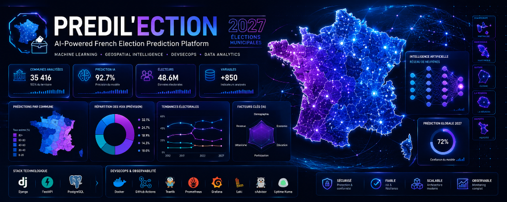

# Political Prediction

## 📋 Introduction

Predil'ection est une **Application web** conçue pour prédire les résultats des élections d'une commune ainsi que de consulter les données associées. Développée dans le cadre d'une formation en Data IA, cette Application possède des validations robustes et une couverture de tests.

**Objectif :** Fournir une interface intuitive pour les utilisateurs afin de consulter les prédictions électorales basées sur des données historiques et des modèles de machine learning.

---

## 🎯 Description

**Notre application** est une application web permettant de :

- ✅ Prédire les résultats électoraux d'une commune
- ✅ Afficher les données historiques des élections
- ✅ Fournir une interface utilisateur intuitive et responsive grâce à une carte interactive
- ✅ Authentifier les utilisateurs de manière sécurisée

### Fonctionnalités principales

|          Fonctionnalité          |                      Description                      |
| :--------------------------------: | :---------------------------------------------------: |
|     **Authentification**     |            Connexion sécurisée avec Django            |
| **Affichage des données**    | Affichage des données historiques des élections       |
|  **Gestion des utilisateurs**  |           CRUD complet pour les Utilisateurs           |
|   **Modèle de prédiction**   |   Modèle de classification pour les prédictions   |
|  **Validation de données**  |   DTOs et validation robuste de toutes les entrées   |
|   **Gestion des erreurs**   |   Codes d'erreur explicites et messages détaillés   |

---

## 🏗️ Architecture

### Sources de données

- **Données électorales** : Récupérées depuis des sources officielles telles que data.gouv.fr.
- **Données démographiques** : Intégration de données démographiques (INSEE) pour améliorer les prédictions.
- **Données géographiques** : Utilisation de données géographiques pour la visualisation sur la carte interactive.

### Stack technique

- **Frontend :** Django avec HTML, CSS (Bulma)
- **Backend :** FastAPI
- **Base de données :** SQLAlchemy ORM + PostgreSQL
- **Carte interactive** Framework CSS Folium pour la visualisation des données géographiques
- **Authentification :** Django Auth
- **Tests :** Pytest avec couverture de code
- **Documentation :** Swagger UI et ReDoc et commentaires détaillés dans le code

### Infrastructure, Observabilité & DevSecOps (Production)

L'application est déployée sur un VPS (Virtual Private Server) avec une architecture sécurisée, isolée et hautement supervisée :

**Sécurité & Infrastructure de base :**

- 🔒 **[Pare-feu (UFW)](docs/firewall.md)** et 🛡️ **[Fail2Ban](docs/fail2ban.md)** : Protection contre le bruteforce SSH via journal systemd.
- 🐳 **[Docker](docs/docker.md)** & 🚦 **[Traefik](docs/traefik.md)** : Isolation complète, Reverse Proxy, et certificats SSL (Let's Encrypt).

**DevSecOps & CI/CD :**
Le projet utilise un pipeline GitHub Actions automatisé intégrant des contrôles de sécurité stricts :

- 🕵️ **Gitleaks** : Détection de secrets et clés API.
- 🛡️ **CodeQL** : Analyse statique de sécurité (SAST) du code.
- 📦 **Trivy** : Scan de vulnérabilités des images Docker avant la mise en production.

**Observabilité & Supervision :**

- 📈 **Prometheus & Grafana** : Monitoring des ressources du VPS (via **Node Exporter**) et des conteneurs (via **cAdvisor**).
- 📋 **Loki & Promtail** : Centralisation et indexation de tous les logs sans avoir à se connecter en SSH.
- 🚨 **Uptime Kuma** : Supervision de la disponibilité des services et APIs en temps réel.

👉 **[Consulter le détail de l'implémentation Observabilité & DevSecOps](docs/IMPLEMENTATION_OBSERVABILITE_SECOPS.md)**
👉 **[Consulter le plan de montée en charge (Alerting & Résilience)](docs/PLAN_ALERTING_RESILIENCE.md)**
👉 **[Lire le détail de la stratégie de déploiement en équipe (Multi-VPS)](docs/multi_vps_deployment.md)**

### Structure du projet

```
.
├── api
│   └── app
│       ├── core
│       ├── db
│       ├── endpoints
│       ├── model
│       ├── repositories
│       ├── routers
│       ├── schemas
│       ├── services
│       ├── tests
│       ├── utils
│       └── main.py
├── data
├── django_political_app
│   ├── core
│   ├── detail
│   ├── django_political_app
│   ├── map
│   ├── predictions
│   ├── static
│   ├── templates
│   ├── users
│   └── manage.py
├── docs
│   ├── Présentation
├── eda
├── maquette
├── ml
├── monitoring
│   ├── loki
│   ├── prometheus
│   └── promtail
├── requirements.txt
└── README.md
```

## 🔧 Installation

### Prérequis

- **Python** 3.9 ou supérieur
- **PostgreSQL** 12 ou supérieur
- **pip** pour la gestion des dépendances

### Étapes d'installation

1. **Cloner le repository**

   ```bash
   git clone <url-du-repository>
   cd political-prediction
   ```

2. **Créer un environnement virtuel**

   ```bash
   python -m venv venv
   source venv/bin/activate    # Sur macOS/Linux
   # ou
   venv\Scripts\activate        # Sur Windows
   ```

3. **Installer les dépendances**

   ```bash
   pip install -r requirements.txt
   ```

4. **Configurer les variables d'environnement**

   Créez un fichier `.env` dans le dossier api et dans le dossier django_political_app avec les variables suivantes :

   django_political_app/.env :

   ```env
   SECRET_KEY='Ici la secret key de Django'
    DEBUG=false
    DATABASE_NAME=db.sqlite3
    BASE_URL_LOCAL="l'url de fast api"
    BASE_URL="https://geo.api.gouv.fr"
   ```

5. **Initialiser la base de données**

   ```bash
   cd data 
   ```

   exécutez df_election_2012 df_election_2017 full_df_final full_stat pour créer les tables et insérer les données dans la base de données.

   ```bash
   sudo -u postgres psql -c "CREATE DATABASE predilection;"
   sudo -u postgres psql -d predilection -f data/insert_communes.sql
   ```

6. **Lancer l'application**
   fastapi :

   ```bash
   cd api
   uvicorn app.main:app --host 0.0.0.0 --port 8080 --reload
   ```

    django :

    ```bash
    cd django_political_app
    python manage.py collectstaticFévrier
    python manage.py runserver
    ```

L'Application sera accessible sur : `http://127.0.0.1:8000/home/`

---

## 📖 Documentation et tests

### Accéder à la documentation interactive

FastAPI génère automatiquement une documentation interactive :

- **Swagger UI** : [http://localhost:8000/docs](http://localhost:8000/docs)
- **ReDoc** : [http://localhost:8000/redoc](http://localhost:8000/redoc)

### Exécuter les tests

```bash
# Lancer tous les tests
pytest --cov=django_political_app --cov=api/app --cov-report=term-missing --ignore=api/test_db.py -v
```

### Monitoring du modèle de prédiction

- **MLflow** : Utilisé pour suivre les expériences de machine learning, les métriques et les modèles. Accédez à l'interface MLflow pour visualiser les résultats des entraînements et les comparaisons entre les modèles.

Exécutez MLflow avec la commande suivante :

```bash
pip install mlflow

cd ml
python monitoring.py
mlflow ui
```

À noter que le monitoring du modèle est basé sur une version antérieure du projet, et que les données utilisées pour le monitoring ne sont pas à jour. Par conséquent, les résultats affichés dans MLflow peuvent ne pas refléter les performances actuelles du modèle de prédiction
---

## 👥 Auteurs

Ce projet a été développé par une équipe de trois développeurs :

**Contexte :** Projet de formation Développeur Data IA - Simplon

---

## 📝 Licence

Ce projet est fourni à des fins éducatives.

---

**Dernière mise à jour :** Juin 2026
